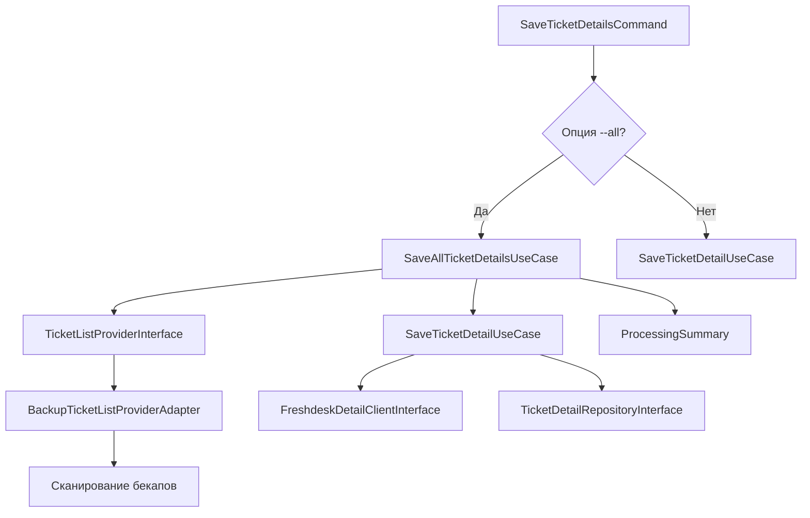

# FD-3: Добавление опции --all для сохранения детальной информации о всех задачах - План для разработчика

## Архитектурные решения

### Общая архитектура
Решение будет реализовано в рамках существующего модуля `TicketDetail`, расширяя его функциональность без нарушения принципов Clean Architecture.

### Слои архитектуры

#### Domain слой
- Создать новый интерфейс `TicketListProviderInterface` для получения списка задач из бекапов
- Создать новый Value Object `ProcessedTicket` для представления результата обработки одной задачи
- Создать новый Value Object `ProcessingSummary` для агрегации результатов обработки
- Расширить существующие исключения или создать новые при необходимости

#### Application слой
- Создать новый UseCase `SaveAllTicketDetailsUseCase` для координации процесса обработки всех задач
- Использовать существующий `SaveTicketDetailUseCase` для обработки каждой отдельной задачи
- Использовать новый `TicketListProviderInterface` для получения списка задач

#### Infrastructure слой
- Создать адаптер `BackupTicketListProviderAdapter` реализующий `TicketListProviderInterface`
- Адаптер будет сканировать директорию бекапов и извлекать ID задач

#### Presentation слой
- Модифицировать существующую команду `SaveTicketDetailsCommand` для поддержки новой функциональности
- Добавить отображение прогресса и сводной информации

## Модель предметной области

### Новые интерфейсы
```php
interface TicketListProviderInterface
{
    /**
     * @return iterable<int> Итератор ID задач
     */
    public function getTicketIds(): iterable;
}
```

### Новые Value Objects

#### ProcessedTicket
```php
final readonly class ProcessedTicket
{
    public function __construct(
        public int $ticketId,
        public string $status, // success|skipped|failed
        public ?string $filePath,
        public ?string $errorMessage,
    ) {
    }
}
```

#### ProcessingSummary
```php
final readonly class ProcessingSummary
{
    public function __construct(
        public int $totalTickets,
        public int $processed,
        public int $skipped,
        public int $failed,
        public DateTimeImmutable $startTime,
        public ?DateTimeImmutable $endTime,
    ) {
    }
}
```

## Сценарии интеграции

1. **Сканирование бекапов**: Новый адаптер будет сканировать директорию бекапов для получения списка ID задач
2. **Обработка задач**: Для каждой задачи будет вызываться существующий UseCase `SaveTicketDetailUseCase`
3. **Отображение прогресса**: Команда будет отображать прогресс выполнения и сводную информацию

## Изменяемые файлы

### Новые файлы:
- `backend/src/TicketDetail/Domain/TicketListProviderInterface.php`
- `backend/src/TicketDetail/Domain/ValueObject/ProcessedTicket.php`
- `backend/src/TicketDetail/Domain/ValueObject/ProcessingSummary.php`
- `backend/src/TicketDetail/Application/UseCase/SaveAllTicketDetailsUseCase.php`
- `backend/src/TicketDetail/Infrastructure/Adapter/BackupTicketListProviderAdapter.php`

### Модифицируемые файлы:
- `backend/src/TicketDetail/Presentation/Console/SaveTicketDetailsCommand.php`

## Последовательность действий

1. **Создание доменных объектов**:
   - Создать `TicketListProviderInterface`
   - Создать `ProcessedTicket` Value Object
   - Создать `ProcessingSummary` Value Object

2. **Создание Application слоя**:
   - Создать `SaveAllTicketDetailsUseCase` с зависимостями от:
     - `TicketListProviderInterface`
     - `SaveTicketDetailUseCase`
     - (опционально) LoggerInterface для логирования

3. **Создание Infrastructure слоя**:
   - Создать `BackupTicketListProviderAdapter` реализующий `TicketListProviderInterface`
   - Адаптер должен сканировать директорию бекапов и извлекать ID задач из JSON файлов

4. **Модификация Presentation слоя**:
   - Модифицировать `SaveTicketDetailsCommand` для поддержки опции `--all`
   - Добавить отображение прогресса и сводной информации
   - Интегрировать новый UseCase

5. **Регистрация зависимостей**:
   - Зарегистрировать новые интерфейсы и реализации в `TicketDetailServiceProvider`
   - Настроить внедрение зависимостей для новых классов

## Зависимости

### Внутренние зависимости
- **FD-1 Backup Module**: Для получения списка задач из существующих бекапов
- **FD-2 Ticket Detail Module**: Использование существующей функциональности сохранения деталей

### Внешние зависимости
- **Freshdesk API**: Источник детальной информации о задачах (через существующие адаптеры)

## Диаграмма потока данных



## Миграции и конфигурация

Не требуются - решение использует существующую структуру хранения и конфигурацию.

## Риски и альтернативы

### R1: Производительность при большом количестве задач
**Риск**: Обработка большого количества задач может занять значительное время.
**Смягчение**: Отображение прогресса, возможность прерывания, rate limiting.

### R2: Ошибки при обработке отдельных задач
**Риск**: Ошибки при обработке отдельных задач могут прервать весь процесс.
**Смягчение**: Продолжение обработки при ошибках, логирование, сводная информация.

### Альтернативы:
1. **Параллельная обработка**: Вместо последовательной обработки реализовать параллельную.
   - Плюсы: Быстрее выполнение
   - Минусы: Сложнее управление ошибками, потенциальные проблемы с rate limiting

2. **Фильтрация задач**: Добавить опции для фильтрации задач по критериям.
   - Плюсы: Более гибкая обработка
   - Минусы: Усложнение интерфейса и логики

## Чек-лист архитектурного соответствия

- [x] Соответствует принципам Clean Architecture
- [x] Соблюдены зависимости между слоями (Presentation → Application → Domain)
- [x] Использована инверсия зависимостей через интерфейсы
- [x] Business logic находится в Application слое
- [x] Infrastructure слой содержит только реализации интерфейсов
- [x] Domain слой содержит чистые объекты и интерфейсы
- [x] Presentation слой содержит только точку входа (команда)
- [x] Не нарушены границы модулей
- [x] Использован модульный монолит подход
- [x] Соответствует CQRS принципам