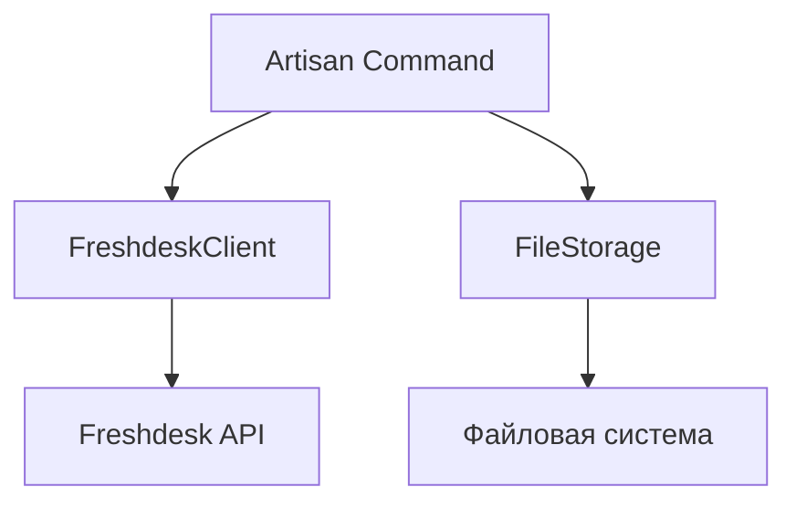

# Архитектура Freshdesk Parser

## Общая архитектура



## Структура классов

### 1. DownloadTicketsCommand

Расположение: `src/Ticket/Application/Command/DownloadTicketsCommand.php`

Наследуется от: `Illuminate\Console\Command`

#### Основные методы:

- `handle()`: Основной метод выполнения команды
  - Получает параметры из переменных окружения
  - Создает экземпляр FreshdeskClient
  - Создает экземпляр FileStorage
  - Выполняет загрузку списка задач
  - Выполняет загрузку детальной информации по каждой задаче

- `downloadTicketsList()`: Загрузка списка задач
  - Использует FreshdeskClient для получения списка задач
  - Сохраняет каждый ответ в FileStorage
  - Обрабатывает постраничную навигацию

- `downloadTicketDetails()`: Загрузка детальной информации
  - Использует FreshdeskClient для получения детальной информации
  - Сохраняет информацию в FileStorage

### 2. FreshdeskClient

Расположение: `src/Ticket/Application/Service/FreshdeskClient.php`

#### Основные методы:

- `__construct(HttpClientInterface $httpClient)`: Конструктор
  - Принимает HTTP клиент для работы с API

- `getTicketsList(int $page)`: Получение списка задач
  - Выполняет GET запрос к `/api/v2/tickets`
  - Параметры: `page`, `per_page` (100 по умолчанию)
  - Возвращает массив задач

- `getTicketDetails(int $ticketId)`: Получение детальной информации о задаче
  - Выполняет GET запрос к `/api/v2/tickets/{id}`
  - Возвращает детальную информацию о задаче

- `setCredentials(string $apiKey, string $domain)`: Установка учетных данных
  - Устанавливает API ключ и домен для запросов

#### Работа с API

- Использует GuzzleHttp в качестве HTTP клиента
- Аутентификация через Basic Auth (API ключ как username, password пустой)
- Обработка ошибок HTTP запросов
- Соблюдение задержки в 1 секунду между запросами

### 3. FileStorage

Расположение: `src/Ticket/Application/Service/FileStorage.php`

#### Основные методы:

- `saveTicketsList(array $tickets, int $page)`: Сохранение списка задач
  - Сохраняет JSON ответ в файл `tickets/list/page_{page}.json`
  - Создает директорию при необходимости

- `saveTicketDetails(array $ticketDetails, int $ticketId)`: Сохранение детальной информации
  - Сохраняет JSON ответ в файл `tickets/detail/{ticketId}.json`
  - Создает директорию при необходимости

- `createDirectory(string $path)`: Создание директории
  - Создает директорию если она не существует

## Обработка постраничной навигации

1. Начинаем с первой страницы (page=1)
2. Загружаем список задач для текущей страницы
3. Если получили задачи, сохраняем ответ и переходим к следующей странице
4. Если задач нет (пустой ответ), завершаем загрузку
5. Между каждой загрузкой страницы добавляем задержку в 1 секунду

## Сохранение файлов

### Структура директорий:

```
storage/
└── tickets/
    ├── list/
    │   ├── page_1.json
    │   ├── page_2.json
    │   └── ...
    └── detail/
        ├── 1.json
        ├── 2.json
        └── ...
```

### Формат файлов:

- `tickets/list/page_{n}.json`: Неизмененный ответ API при получении списка задач
- `tickets/detail/{id}.json`: Неизмененный ответ API при получении детальной информации о задаче

## Обработка ошибок

- Проверка наличия необходимых переменных окружения
- Обработка ошибок HTTP запросов (4xx, 5xx)
- Обработка ошибок при сохранении файлов
- Логирование критических ошибок

## Задержка между запросами

- Используется `sleep(1)` между каждым HTTP запросом
- Применяется как при загрузке списка задач, так и при получении детальной информации