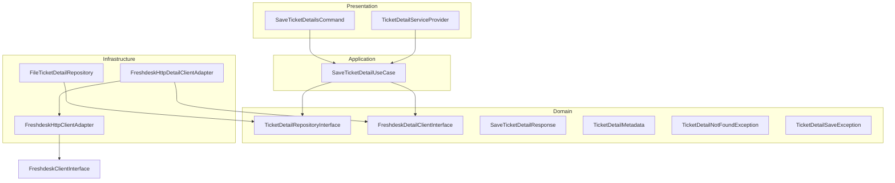

# Модуль TicketDetail - Сохранение детальной информации о задачах

## Описание архитектуры и структуры модуля

Модуль `TicketDetail` реализует функциональность для сохранения детальной информации о задачах из Freshdesk API в файловую систему. Модуль следует принципам Clean Architecture и обеспечивает четкое разделение ответственности между слоями.

### Архитектурные слои



### Структура директорий

```
TicketDetail/
├── Application/
│   └── UseCase/
│       └── SaveTicketDetailUseCase.php
├── Domain/
│   ├── FreshdeskDetailClientInterface.php
│   ├── TicketDetailRepositoryInterface.php
│   ├── Response/
│   │   └── SaveTicketDetailResponse.php
│   ├── ValueObject/
│   │   └── TicketDetailMetadata.php
│   └── Exception/
│       ├── TicketDetailNotFoundException.php
│       └── TicketDetailSaveException.php
├── Infrastructure/
│   ├── Adapter/
│   │   └── FreshdeskHttpDetailClientAdapter.php
│   └── Repository/
│       └── FileTicketDetailRepository.php
└── Presentation/
    ├── Console/
    │   └── SaveTicketDetailsCommand.php
    └── Config/
        ├── TicketDetailServiceProvider.php
        └── freshdesk.php
```

## Описание предметной области (Domain)

### Интерфейсы

#### `TicketDetailRepositoryInterface`
Контракт для сохранения детальной информации задач в хранилище:
- `save(int $ticketId, string $jsonData, TicketDetailMetadata $metadata): void` - сохраняет JSON данные задачи
- `exists(int $ticketId): bool` - проверяет существование файла с детальной информацией

#### `FreshdeskDetailClientInterface`
Контракт для получения детальной информации из Freshdesk API:
- `getTicketDetail(int $ticketId): string` - возвращает сырой JSON с детальной информацией задачи

**Примечание:** Данный интерфейс реализуется через адаптер к `FreshdeskClientInterface` из модуля Backup.

### Value Objects

#### `TicketDetailMetadata`
Неизменяемый объект с метаданными сохранения:
- `savedAt`: DateTimeImmutable - дата и время сохранения
- `status`: string - статус сохранения ('success'|'partial'|'failed')
- `size`: int - размер файла в байтах

### Response DTO

#### `SaveTicketDetailResponse`
Объект для передачи результата сохранения:
- `ticketId`: int - ID задачи
- `status`: string - статус выполнения ('success'|'partial'|'failed')
- `filePath`: string - путь к сохраненному файлу
- `savedAt`: DateTimeInterface - дата и время сохранения
- `errorMessage`: ?string - сообщение об ошибке (если есть)

### Исключения

- `TicketDetailNotFoundException` - выбрасывается когда детальная информация о задаче не найдена
- `TicketDetailSaveException` - выбрасывается при ошибках сохранения файла

## Описание реализации бизнес-логики (Application)

### `SaveTicketDetailUseCase`
Основной UseCase для координации процесса сохранения детальной информации:

**Зависимости:**
- `FreshdeskDetailClientInterface` - для получения данных из Freshdesk
- `TicketDetailRepositoryInterface` - для сохранения данных в файловую систему

**Методы:**
- `execute(int $ticketId, bool $forceOverwrite = false): SaveTicketDetailResponse`

**Логика работы:**
1. Проверяет существование файла (если не требуется перезапись)
2. Получает детальную информацию из Freshdesk API через клиент
3. Создает метаданные с текущей датой и размером данных
4. Сохраняет данные через репозиторий
5. Возвращает результат с информацией о сохранении

**Обработка ошибок:**
- При ошибках возвращает `SaveTicketDetailResponse` со статусом 'failed' и сообщением об ошибке
- Не выбрасывает исключения на верхний уровень, обеспечивая устойчивость консольной команды
- При существующем файле (без флага --force) возвращает успешный ответ с сообщением "Файл уже существует"

## Документация API интерфейсов (Presentation)

### Консольная команда

**`SaveTicketDetailsCommand`**

**Сигнатура:**
```bash
php artisan backup:ticket-details [--ticket-id=ID] [--all] [--force]
```

**Опции:**
- `--ticket-id=ID` - ID конкретной задачи для сохранения
- `--all` - Сохранить детальную информацию для всех задач (**пока не реализовано**)
- `--force` - Принудительно перезаписать существующие файлы

**Примеры использования:**
```bash
# Сохранить детальную информацию для задачи с ID 123
php artisan backup:ticket-details --ticket-id=123

# Сохранить детальную информацию для задачи с ID 123, перезаписав существующий файл
php artisan backup:ticket-details --ticket-id=123 --force

# Показать справку
php artisan backup:ticket-details --help
```

**Вывод при успехе:**
```
✅ Задача #123: success
   Файл: storage/backups/detail/123.json
   Сохранено: 2025-12-27 20:04:00
```

**Вывод при существующем файле:**
```
✅ Задача #123: success
   Файл: storage/backups/detail/123.json
   Сохранено: 2025-12-27 20:04:00
   Файл уже существует
```

**Вывод при ошибке:**
```
❌ Задача #123: failed
   Файл: storage/backups/detail/123.json
   Сохранено: 2025-12-27 20:04:00
   Ошибка: Не удалось подключиться к Freshdesk API
```

## Интеграция с внешними системами (Infrastructure)

### `FileTicketDetailRepository`
Реализация репозитория для сохранения в файловую систему:

**Хранилище:**
- Базовый путь: `storage/backups/detail/`
- Формат файла: `{ticket_id}.json`
- Пример: `storage/backups/detail/123.json`

**Особенности реализации:**
- Автоматическое создание директорий при необходимости
- Проверка успешности записи файла
- Валидация прав доступа к файлам
- Поддержка кастомного базового пути для тестирования
- Обработка ошибок с детализированными сообщениями

### `FreshdeskHttpDetailClientAdapter`
Адаптер для интеграции с Freshdesk API:

**Архитектурная роль:**
- Реализует `FreshdeskDetailClientInterface` для совместимости с Domain слоем
- Делегирует вызовы к `FreshdeskClientInterface` из модуля Backup
- Обеспечивает изоляцию модуля TicketDetail от прямых зависимостей Backup модуля

**Интеграция с Freshdesk API (через Backup модуль):**
- Получает полную детальную информацию задачи, включая conversations
- Обрабатывает пагинацию conversations через `/api/v2/tickets/{id}/conversations`
- Поддерживает retry механизм с экспоненциальным backoff
- Обрабатывает rate limits (429) и ошибки авторизации (401)
- Корректно обрабатывает ошибки подключения (RequestException, ConnectException)
- При ошибках получения conversations продолжает с основными данными

**Технические детали реализации Freshdesk API:**
- **Базовый URL:** `https://{domain}.freshdesk.com/api/v2/`
- **Аутентификация:** HTTP Basic Auth с API ключом
- **Rate Limiting:** 1 секунда задержка между запросами
- **Retry:** до 3 попыток с экспоненциальным backoff (1с, 2с, 4с)
- **Пагинация:** 100 записей на страницу для conversations
- **Обработка ошибок:** Специализированные исключения для разных типов ошибок

## Зависимости

### Внешние зависимости
- **Freshdesk API** - источник детальных данных о задачах
- **Guzzle HTTP Client** - для выполнения HTTP запросов
- **Файловая система** - хранилище детальной информации

### Внутренние зависимости
- **Backup Module** - для получения данных из Freshdesk API через `FreshdeskClientInterface`
- **Core Module** - общепроектные исключения и утилиты

### Переменные окружения

В файле `backend/.env.example` должны быть определены:
```env
# Freshdesk API Configuration
FRESHDESK_API_KEY=your_freshdesk_api_key_here
FRESHDESK_DOMAIN=your_company_domain
```

### Конфигурация

Файл `backend/src/TicketDetail/Presentation/Config/freshdesk.php`:
```php
return [
    'api_key' => env('FRESHDESK_API_KEY'),
    'domain' => env('FRESHDESK_DOMAIN'),
];
```

## Тестирование модуля

**Статус тестов:** Тесты для модуля TicketDetail еще не реализованы.

**Планируемая структура тестов:**
- **Application тесты**: `backend/tests/Suite/TicketDetail/Application/`
- **Infrastructure тесты**: `backend/tests/Suite/TicketDetail/Infrastructure/`
- **Presentation тесты**: `backend/tests/Suite/TicketDetail/Presentation/`

### Основные сценарии тестирования (планируемые)

1. **Успешное сохранение детальной информации**
   - Проверка корректного сохранения JSON данных
   - Проверка создания метаданных
   - Проверка возвращаемого ответа

2. **Обработка ошибок**
   - Ошибки подключения к Freshdesk API
   - Ошибки записи в файловую систему
   - Обработка rate limits

3. **Проверка существования файлов**
   - Проверка метода `exists()` репозитория
   - Проверка логики перезаписи файлов

4. **Консольная команда**
   - E2E тесты выполнения команды
   - Валидация аргументов и опций
   - Проверка вывода в консоль

## Сценарии использования

### Сценарий 1: Сохранение детальной информации для одной задачи

1. Пользователь выполняет команду `php artisan backup:ticket-details --ticket-id=123`
2. Система проверяет существование файла `storage/backups/detail/123.json`
3. Если файл не существует или указан флаг `--force`, система:
   - Вызывает `FreshdeskDetailClientInterface::getTicketDetail(123)`
   - Делегирует вызов к `FreshdeskClientInterface::getTicketDetail(123)` в Backup модуле
   - Выполняет HTTP GET запрос к `/api/v2/tickets/123` с Basic Auth
   - Проверяет наличие conversations и получает их с пагинацией через `/api/v2/tickets/123/conversations`
   - Сохраняет полный JSON с объединенными conversations
   - Возвращает результат с информацией о сохранении
4. Система выводит статус выполнения в консоль

### Сценарий 2: Обработка ошибок API

1. **При rate limit (429):**
   - Система выполняет retry с экспоненциальным backoff (1с, 2с, 4с)
   - После 3 неудачных попыток выбрасывается `FreshdeskApiRateLimitException`
   - UseCase преобразует исключение в ответ со статусом 'failed'

2. **При ошибке авторизации (401):**
   - Выбрасывается `FreshdeskApiUnauthorizedException`
   - Возвращается ответ со статусом 'failed' и сообщением об ошибке

3. **При ошибке подключения:**
   - Выбрасывается `FreshdeskApiConnectionException`
   - Система продолжает работу с другими задачами (если выполняется --all)

4. **При частичном ответе (ошибки получения conversations):**
   - Сохраняются доступные данные (основная информация задачи)
   - В ответе статус остается 'success' (так как основные данные сохранены)

### Сценарий 3: Проверка существования файла

1. Пользователь выполняет команду для задачи, файл которой уже существует
2. Система проверяет существование файла через `repository->exists()`
3. Если файл существует и не указан флаг `--force`, система:
   - Возвращает успешный ответ без повторного сохранения
   - В поле `errorMessage` указывает "Файл уже существует"
4. В консоль выводится сообщение об успешном сохранении с информацией о существующем файле

### Сценарий 4: Обработка пагинации conversations

1. При получении детальной информации о задаче с большим количеством переписки
2. Система проверяет наличие поля `conversations` в основном ответе
3. Если conversations есть, система получает ВСЕ conversations через отдельные запросы:
   - Выполняет запросы к `/api/v2/tickets/{id}/conversations?page=N&per_page=100`
   - Объединяет все страницы в единый массив
   - Заменяет conversations в основном ответе полным массивом
4. Сохраняет итоговый JSON с полной перепиской

## Особенности реализации

### Интеграция с модулем Backup
Модуль TicketDetail использует паттерн Adapter для интеграции с модулем Backup. Это обеспечивает:
- Слабую связанность между модулями
- Возможность независимого развития модулей
- Повторное использование логики работы с Freshdesk API

### Обработка conversations
Модуль получает все conversations для задачи с обработкой пагинации через Freshdesk API. Это обеспечивает полноту сохраняемых данных даже для задач с большим количеством переписки. При ошибках получения conversations система не прерывает выполнение, а сохраняет доступные данные.

### Механизм retry
Реализован механизм retry с экспоненциальным backoff для обработки временных ошибок и rate limits. Это повышает надежность системы при работе с внешним API.

### Безопасность
API ключ Freshdesk хранится в переменных окружения и не попадает в логи или вывод команды, обеспечивая безопасность конфиденциальных данных.

### Производительность
- Rate limiting: 1 секунда задержка между запросами к Freshdesk API
- Оптимизированная работа с файловой системой
- Эффективное использование памяти при обработке больших JSON данных
- Graceful degradation при ошибках получения дополнительных данных (conversations)

### Файловая структура данных
Сохраненные файлы имеют следующую структуру:
```json
{
  "id": 123,
  "subject": "Sample Ticket",
  "description": "...",
  "status": 2,
  "priority": 1,
  "conversations": [
    {
      "id": 456,
      "body": "...",
      "user_id": 789,
      "created_at": "2025-12-27T20:04:00Z"
    }
    // ... все conversations с пагинацией
  ]
  // ... другие поля Freshdesk API
}
```

### Ограничения текущей реализации
- **Опция --all не реализована:** В настоящее время команда поддерживает только сохранение одной задачи по ID
- **Отсутствуют тесты:** Модуль не покрыт автоматизированными тестами
- **Отсутствует интеграция со списком задач:** Не использует данные из Backup модуля для получения списка задач

## Развитие модуля

### Планируемые улучшения
1. Реализация опции `--all` для сохранения всех задач
2. Создание автоматизированных тестов (Unit, Integration, E2E)
3. Добавление прогресс-бара для длительных операций
4. Интеграция с очередями для асинхронной обработки
5. Возможность скачивания вложений (attachments)
6. Валидация целостности сохраненных данных