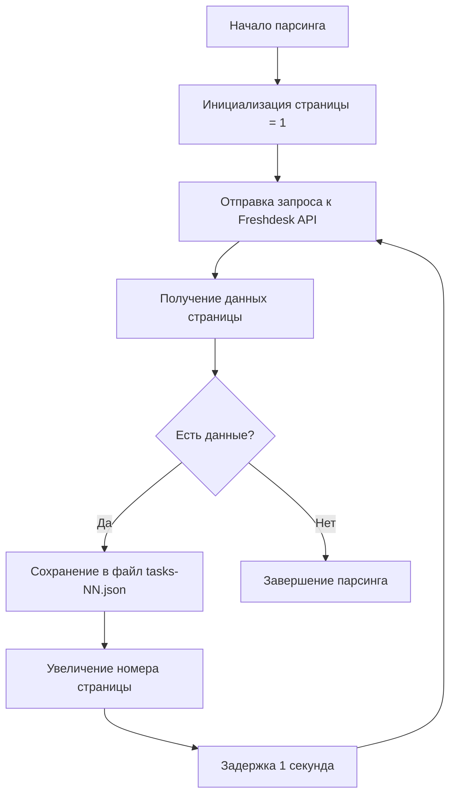

# Спецификация парсинга задач из Freshdesk

## Назначение

Эта спецификация описывает функциональность парсинга списка всех задач (тикетов) из Freshdesk API с сохранением оригинальных JSON данных для последующей обработки.

## Требования к функциональности

### Постраничная загрузка данных

1. Загрузка данных должна осуществляться постранично с размером страницы 100 записей
2. Использовать Freshdesk API endpoint для получения списка тикетов
3. Обрабатывать все доступные страницы до тех пор, пока не будут получены все данные
4. Между запросами к API должна быть задержка в 1 секунду для соблюдения лимитов API

### Сохранение JSON файлов

1. Все загруженные JSON данные должны сохраняться в неизменном виде
2. Файлы должны сохраняться в директории `backend/storage/freshdesk/`
3. Имя файла должно формироваться по шаблону: `tasks-{номер страницы}.json`
4. Каждая страница данных сохраняется в отдельный файл

### Структура файлов и директорий

```
backend/
└── storage/
    └── freshdesk/
        ├── tasks-1.json
        ├── tasks-2.json
        ├── tasks-3.json
        └── ...
```

## Технические детали

### API Endpoint

Для получения списка тикетов используется endpoint:
```
GET https://{domain}.freshdesk.com/api/v2/tickets
```

Параметры запроса:
- `per_page=100` - количество записей на странице
- `page={номер страницы}` - номер страницы

### Заголовки запроса

- `Authorization: Basic {api_key}` - базовая аутентификация
- `Content-Type: application/json` - тип содержимого

## Примеры использования

### Пример вызова API

```bash
curl -u {api_key}:X -H "Content-Type: application/json" \
  "https://{domain}.freshdesk.com/api/v2/tickets?per_page=100&page=1"
```

### Пример структуры ответа

```json
[
  {
    "id": 1,
    "subject": "Тестовый тикет",
    "description": "Описание тикета",
    "status": 2,
    "priority": 1,
    "requester_id": 123,
    "created_at": "2025-12-21T10:00:00Z",
    "updated_at": "2025-12-21T10:00:00Z"
  }
]
```

## Поток выполнения


